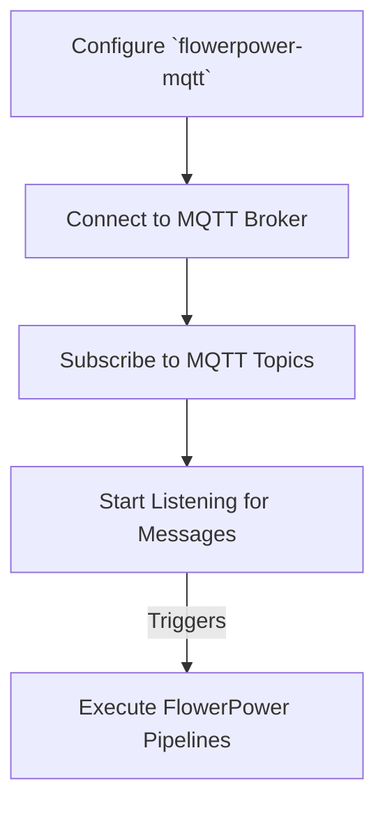

# Getting Started

This guide will help you quickly set up and start using `flowerpower-mqtt` for both CLI and programmatic usage.

## Quick Start: CLI

The fastest way to get started with `flowerpower-mqtt` is by using its powerful command-line interface.

1.  **Create Configuration Interactively**

    This command guides you through creating a basic `mqtt_config.yml` file.

    ```bash
    flowerpower-mqtt config create --interactive
    ```

    You'll be prompted for details like your MQTT broker hostname, port, and whether to enable the job queue.

2.  **Connect to MQTT Broker**

    Use your newly created configuration file to connect to the MQTT broker.

    ```bash
    flowerpower-mqtt connect --config mqtt_config.yml
    ```

3.  **Subscribe to Topics**

    Subscribe to an MQTT topic and link it to a FlowerPower pipeline. Replace `"sensors/+/temperature"` with your desired topic pattern and `"temperature_processor"` with the name of your FlowerPower pipeline.

    ```bash
    flowerpower-mqtt subscribe "sensors/+/temperature" temperature_processor --qos 1
    ```

4.  **Start Listening**

    Begin listening for incoming MQTT messages. This command will block until you press `Ctrl+C`.

    ```bash
    flowerpower-mqtt listen
    ```

    For asynchronous processing with a job queue, you would typically start an RQ worker in a separate terminal:

    ```bash
    # In a separate terminal
    rq worker mqtt_pipelines --url redis://localhost:6379
    ```

    Then, you can start the `flowerpower-mqtt` listener in the background:

    ```bash
    flowerpower-mqtt listen --background &
    flowerpower-mqtt monitor --interval 5
    ```

## Quick Start: Programmatic Usage

For integrating `flowerpower-mqtt` into your Python applications, use its programmatic API.

1.  **Basic Synchronous Usage**

    This example demonstrates how to connect to an MQTT broker, subscribe to a topic, and start listening for messages synchronously.

    ```python
    import asyncio
    from flowerpower_mqtt import MQTTPlugin

    async def main():
        # Create plugin instance
        mqtt = MQTTPlugin(
            broker="localhost",
            base_dir="/path/to/flowerpower/project" # Replace with your FlowerPower project path
        )
        
        # Connect to broker
        await mqtt.connect()
        
        # Subscribe to topic
        await mqtt.subscribe("sensors/temperature", "temperature_pipeline", qos=1)
        
        # Start listening (blocks until Ctrl+C)
        await mqtt.start_listener()

    if __name__ == "__main__":
        asyncio.run(main())
    ```

2.  **Asynchronous Usage with Job Queue**

    This example shows how to enable the RQ job queue for asynchronous pipeline execution.

    ```python
    import asyncio
    from flowerpower_mqtt import MQTTPlugin

    async def main():
        # Create plugin with RQ job queue enabled
        mqtt = MQTTPlugin(
            broker="mqtt.example.com",
            base_dir="/path/to/flowerpower/project", # Replace with your FlowerPower project path
            use_job_queue=True,
            redis_url="redis://localhost:6379"
        )
        
        await mqtt.connect()
        
        # Subscribe with async execution
        await mqtt.subscribe("sensors/+/data", "sensor_processor", qos=1, execution_mode="async")
        await mqtt.subscribe("alerts/critical", "alert_handler", qos=2, execution_mode="sync")
        
        # Start listener in background
        await mqtt.start_listener(background=True)
        
        # Do other work...
        await asyncio.sleep(60)
        
        # Stop gracefully
        await mqtt.stop_listener()

    if __name__ == "__main__":
        asyncio.run(main())
    ```

## Core Workflow

The typical workflow for `flowerpower-mqtt` involves these steps:



This workflow can be managed entirely via the CLI, programmatically within your Python applications, or through a hybrid approach.