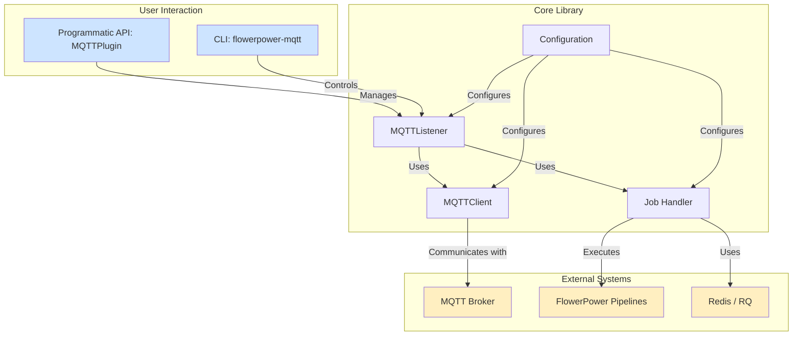

# Welcome to FlowerPower-MQTT Documentation

A simple yet powerful MQTT plugin for [FlowerPower](https://github.com/legout/flowerpower) that triggers pipeline execution when messages arrive on subscribed topics. `flowerpower-mqtt` features configurable QoS levels, optional RQ job queue integration for asynchronous processing, and a beautiful CLI for easy management.

## Key Features

*   **Simple API**: Easy-to-use interface for connecting, subscribing, and listening.
*   **QoS Support**: Full MQTT QoS support (0, 1, 2) for reliable message delivery.
*   **Async Processing**: Optional RQ job queue integration for background pipeline execution.
*   **Multiple Execution Modes**: `sync`, `async`, and `mixed` (QoS-based routing).
*   **Topic Wildcards**: Support for MQTT topic patterns (`+`, `#`).
*   **Graceful Shutdown**: Ctrl+C handling and proper cleanup.
*   **Statistics & Monitoring**: Built-in metrics and job tracking.
*   **Configuration Management**: YAML-based configuration support with `msgspec` validation.
*   **Automatic Reconnection**: Robust connection handling with configurable retry attempts and exponential backoff.
*   **Comprehensive CLI**: Rich, colorful CLI with interactive configuration, real-time monitoring, and job queue management.

## Architecture Overview

The `flowerpower-mqtt` library is designed with modularity in mind, allowing for flexible integration and robust operation. The core components interact to provide seamless MQTT message processing and FlowerPower pipeline execution.

*   **User Interaction**: Users can interact with the library either programmatically through the `MQTTPlugin` API or via the command-line interface (`flowerpower-mqtt` CLI).
*   **Core Library**:
    *   `MQTTListener`: The central component responsible for listening to MQTT messages and coordinating their processing.
    *   `MQTTClient`: Handles the low-level MQTT connection, subscription, and message reception.
    *   `Configuration`: Manages the application's settings, including MQTT broker details, job queue settings, and subscriptions.
    *   `Job Handler`: Integrates with the RQ job queue for asynchronous pipeline execution.
*   **External Systems**:
    *   `MQTT Broker`: The external MQTT server that `flowerpower-mqtt` connects to.
    *   `FlowerPower Pipelines`: The actual data processing workflows triggered by MQTT messages.
    *   `Redis / RQ`: Used for managing the asynchronous job queue.

## Who is this for?

This documentation is for:

*   **FlowerPower Users**: If you are already using FlowerPower and want to integrate MQTT-based data sources into your pipelines.
*   **Developers**: If you are building applications that need to react to MQTT messages by executing Python-based data pipelines.
*   **System Administrators**: If you need to deploy, monitor, and manage MQTT-driven data processing workflows.

## Relationship with FlowerPower

`flowerpower-mqtt` acts as a specialized plugin for the `flowerpower` library, extending its capabilities to include MQTT message processing. It leverages FlowerPower's pipeline execution engine to process incoming MQTT data, making it easy to integrate real-time MQTT streams into your existing data workflows.