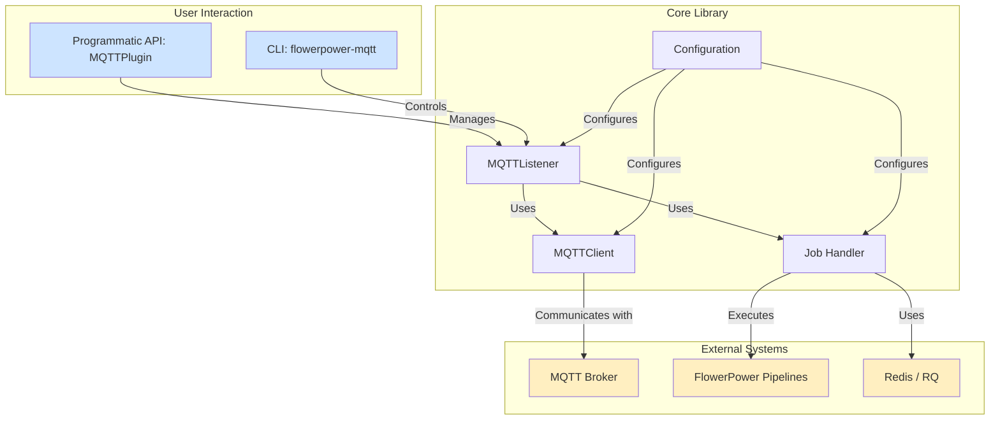

# FlowerPower-MQTT Documentation Plan

This document outlines the structure and content for the `flowerpower-mqtt` library documentation, designed for MkDocs with the Material theme and Mermaid support.

## Documentation Structure

The documentation will be organized into the following main sections:

```
docs/
├── index.md
├── getting-started.md
├── installation.md
├── core-concepts.md
├── programmatic-usage/
│   ├── index.md
│   ├── mqtt-plugin.md
│   ├── subscriptions.md
│   └── configuration.md
├── cli-reference.md
├── flowerpower-integration.md
├── async-processing.md
├── monitoring.md
├── examples.md
├── advanced-topics.md
├── contributing.md
├── changelog.md
└── api/
    └── (auto-generated from docstrings)
```

## High-Level Architecture

A Mermaid diagram will be included in the `index.md` to provide a visual overview of the library's architecture.



## Content Outline

### 1. Home (`index.md`)

-   **Introduction:** Brief overview of `flowerpower-mqtt`, its purpose, and key features.
-   **Architecture Overview:** The Mermaid diagram shown above with a brief explanation.
-   **Who is this for?** Target audience (FlowerPower users, developers needing MQTT integration).
-   **Relationship with `flowerpower`:** Clarify that it's a plugin, not a standalone library.

### 2. Getting Started (`getting-started.md`)

-   **Quick Start: CLI:** A 5-minute guide to getting the CLI up and running.
-   **Quick Start: Programmatic:** A simple `asyncio` example to demonstrate basic programmatic usage.
-   **Core Workflow:** A simple diagram showing the typical workflow: Configure -> Connect -> Subscribe -> Listen.

### 3. Installation (`installation.md`)

-   **Prerequisites:** Python version, FlowerPower, Redis (optional).
-   **Recommended Installation (uv):** Instructions using `uv pip install`.
-   **Alternative Installation (pip):** Standard pip installation.
-   **Development Installation:** For contributors.
-   **Shell Completion:** Instructions for enabling CLI shell completion.

### 4. Core Concepts (`core-concepts.md`)

-   **The `MQTTPlugin`:** The central class for programmatic control.
-   **Execution Modes:**
    -   `sync`: Explanation and use cases.
    -   `async`: Explanation and use cases.
    -   `mixed`: How QoS-based routing works.
-   **Configuration:** Overview of the YAML-based configuration.
-   **Statistics and Monitoring:** Introduction to the built-in metrics.

### 5. Programmatic Usage / API Guide

-   **`programmatic-usage/index.md`:** Overview of the programmatic API.
-   **`programmatic-usage/mqtt-plugin.md`:**
    -   Initializing the plugin (`__init__`, `from_config`).
    -   Connecting and disconnecting (`connect`, `disconnect`, context manager).
-   **`programmatic-usage/subscriptions.md`:**
    -   Subscribing to topics (`subscribe`, `subscribe_bulk`).
    -   QoS levels explained.
    -   Unsubscribing (`unsubscribe`).
    -   Listing subscriptions (`get_subscriptions`).
-   **`programmatic-usage/configuration.md`:**
    -   Loading and saving configurations (`from_config`, `save_config`).
    -   Modifying configuration at runtime.

### 6. CLI Reference (`cli-reference.md`)

-   **Structure:** Organized by command groups (`config`, `jobs`, etc.).
-   **Global Options:** `--config`, `--json`, etc.
-   **Commands:**
    -   `connect`: Detailed explanation and examples.
    -   `disconnect`: Usage.
    -   `subscribe`: All options with examples.
    -   `unsubscribe`: Usage.
    -   `listen`: All options with examples.
    -   `status`: Explanation of the output.
    -   `monitor`: How to use and interpret the real-time view.
    -   `list-subscriptions`: Usage.
    -   `config create|validate|show|edit`: Detailed guide for each.
    -   `jobs status|worker`: How to manage RQ workers via the CLI.
-   **JSON Output:** How to use the `--json` flag for scripting.

### 7. FlowerPower Integration (`flowerpower-integration.md`)

-   **Pipeline Input:** Detailed explanation of the data passed to pipelines (`mqtt_message`, `mqtt_topic`, `mqtt_qos`, etc.).
-   **Example Pipeline:** A complete, well-commented example of a pipeline that processes MQTT data.
-   **Best Practices:** Tips for designing robust pipelines for MQTT data.

### 8. Asynchronous Processing (`async-processing.md`)

-   **When to use Async:** Use cases for background processing.
-   **Configuration:** How to enable and configure the RQ job queue.
-   **RQ Worker:** How to start and manage the `rq worker`.
-   **Job Lifecycle:** What happens when a message is processed asynchronously.
-   **Monitoring Jobs:** Using the CLI and programmatic methods to check job status.

### 9. Monitoring (`monitoring.md`)

-   **CLI Monitoring:** In-depth guide to `flowerpower-mqtt monitor`.
-   **Programmatic Statistics:** How to use `get_statistics()` and what the metrics mean.
-   **Interpreting the Data:** What to look for (error counts, message rates, etc.).

### 10. Examples (`examples.md`)

-   A gallery of practical, copy-paste-friendly examples covering common use cases.
    -   Simple synchronous listener.
    -   Async processing with RQ.
    -   Using a configuration file.
    -   Mixed-mode processing based on QoS.
    -   CLI-only workflow.
    -   Hybrid workflow (CLI for setup, Python for logic).

### 11. Advanced Topics (`advanced-topics.md`)

-   **Error Handling:** Common exceptions (`ConnectionError`, `SubscriptionError`) and how to handle them.
-   **Graceful Shutdown:** How `Ctrl+C` is handled.
-   **Context Manager:** Using `async with`.
-   **Automatic Reconnection:** How the client handles broker disconnects.

### 12. Contributing (`contributing.md`)

-   Standard contribution guidelines: forking, branching, PRs.
-   **Development Setup:** How to set up the development environment.
-   **Running Tests:** `pytest`.
-   **Code Style & Linting:** `black`, `ruff`, `mypy`.

### 13. Changelog (`changelog.md`)

-   A log of changes for each version, derived from the `README.md`.

### 14. API Reference (`api/`)

-   This section will be auto-generated from the docstrings in the source code using a tool like `mkdocstrings`.
-   It will cover the public API of `flowerpower_mqtt`, including `MQTTPlugin`, configuration classes, and public functions.